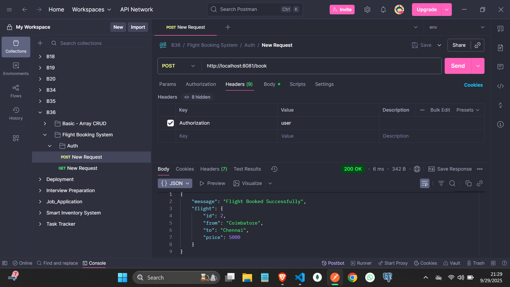

In our live session i pass the Authorization like this

❌ Wrong Format (I used in live session)
Authorization: "user"

✅ Right Format
Authorization: user (or) admin

Don't use Double or Single Quotation in the Authorization value

